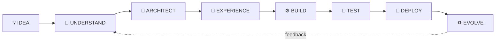
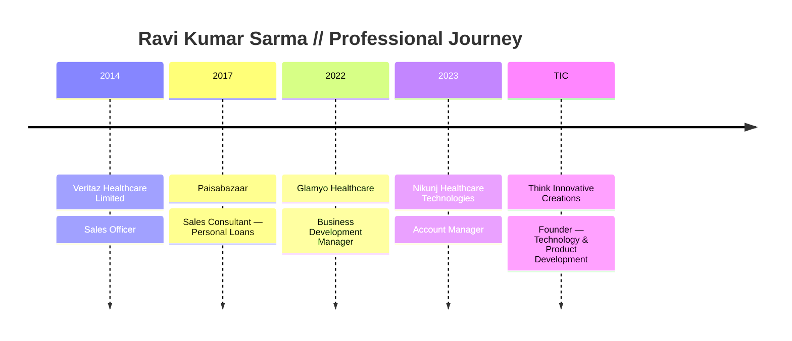

<div align="center">


<br/>

[](https://coder-blocks.github.io/ravi-3d-portfolio/)
[](https://coder-blocks.github.io/ravi-3d-portfolio/course/)
[](https://www.linkedin.com/in/ravi-kumar-1633b7244/)
[](mailto:ravigarimella9@gmail.com)

### `FOUNDER // PRODUCT BUILDER // AI-ASSISTED CREATOR // BUSINESS DEVELOPER`

</div>

---

## ◈ BOOT SEQUENCE

```text
> loading identity................ GARIMELLA RAVI KUMAR SARMA
> loading studio.................. THINK INNOVATIVE CREATIONS (TIC)
> loading mission................. TURN IDEAS INTO WORKING PRODUCTS
> loading modes................... SOFTWARE / WEB / AI / MOBILE / CREATIVE TECH
> innovation core................. ONLINE
```

I build practical digital products from the first idea to a working experience — combining **product thinking, UI/UX, software development, AI-assisted workflows, business development, creative technology, testing, and deployment**.

Rather than treating technology and business as separate worlds, I work across both: **understand the problem → design the experience → build the product → communicate the value → improve the system**.


---

## ⚡ TIC IDEA REACTOR // SELF-EVOLVING PROFILE

<div align="center">


### This panel changes itself every day.

A date-seeded **Product Genome** combines a real-world domain + interaction mechanism + hard constraint to generate a fresh product direction — with **no paid AI API and no manual edit required**.

[](mailto:ravigarimella9@gmail.com?subject=TIC%20Idea%20Reactor%20Challenge&body=Name%3A%0AChallenge%20Title%3A%0AProblem%20to%20solve%3A%0AWho%20faces%20it%3A%0APreferred%20platform%20(Web%2FWindows%2FAndroid%2FOffline)%3A%0AHard%20constraint%3A)
[](https://github.com/Coder-Blocks/Coder-Blocks/blob/main/DAILY_IDEA.md)

`VISITOR PROBLEM → PUBLIC CHALLENGE → TIC THINKING → POSSIBLE PRODUCT`

</div>


---

## 🤖 TIC DIGITAL TWIN // INTENT ROUTER

<div align="center">


### Meet the profile's virtual guide.

The **TIC Digital Twin** is a portal-style profile layer. Instead of sending every visitor into the same path, it routes them by intention.

[](https://coder-blocks.github.io/ravi-3d-portfolio/)
[](https://coder-blocks.github.io/ravi-3d-portfolio/course/)
[](https://www.linkedin.com/in/ravi-kumar-1633b7244/)
[](mailto:ravigarimella9@gmail.com?subject=TIC%20Challenge%20for%20Digital%20Twin&body=Name%3A%0AChallenge%20Title%3A%0AProblem%20to%20solve%3A%0AWho%20faces%20it%3A%0APreferred%20platform%20(Web%2FWindows%2FAndroid%2FOffline)%3A%0AHard%20constraint%3A)

</div>

```text
IF YOU WANT TO...
├─ BUILD      → Explore portfolio, products and execution style
├─ LEARN      → Explore TIC courses and learning paths
├─ HIRE       → Reach out for services, collaboration or work
└─ CHALLENGE  → Send a real-world problem for TIC to think about
```

> The Challenge route now uses a direct email-based intake so visitors don't hit a broken 404 page.

---

## ◈ TIC BUILD MATRIX

<div align="center">

| 01 // PRODUCT SYSTEMS | 02 // WEB WORLDS | 03 // AI LAYER |
|---|---|---|
| Windows applications | React / Vite experiences | Prompt engineering |
| Offline-first products | Interactive interfaces | AI-assisted development |
| Local-data systems | 3D-style portfolios | Content & workflow automation |
| Licensing concepts | Responsive platforms | Product ideation |

| 04 // MOBILE | 05 // CREATIVE TECH | 06 // BUSINESS |
|---|---|---|
| Android applications | Video / visual design | Business development |
| Offline processing | Motion-led UI ideas | CRM & client solutions |
| Utility products | Brand experiences | Requirements & planning |
| Product prototypes | Digital storytelling | Customer communication |

</div>

---

## ◈ MISSION CONTROL

<table>
<tr>
<td width="33%" valign="top">

### 🔭 VIHAA Jyotish
**Offline Vedic Astrology Suite**

Lagna, planetary positions, Nakshatra, Navamsa, Vimshottari Dasha, transits, PDF reports and licensing-oriented product architecture.

`Windows` `Offline` `.NET` `Reports`

</td>
<td width="33%" valign="top">

### 🏠 VIHAA House Design
**Idea → 2D → 3D → Walkthrough**

Offline-oriented house planning concept designed around site inputs, plan generation, 3D visualization, interiors and project workflow.

`Architecture` `3D` `Planning` `Product UX`

</td>
<td width="33%" valign="top">

### 🎬 VIHAA Downloader
**Media Utility for Windows**

Video/audio download workflows, quality selection, yt-dlp + FFmpeg integration, progress feedback and desktop packaging.

`WPF` `.NET` `FFmpeg` `yt-dlp`

</td>
</tr>

<tr>
<td width="33%" valign="top">

### 🦺 VIHAA EHS
**HSE Automation Concept**

On-premise Windows product concept for structured HSE records, reporting, automation and enterprise workflows.

`HSE` `WPF` `On-Premise` `Automation`

</td>
<td width="33%" valign="top">

### 💊 Pharmacy Management
**Local Business Software**

Inventory, billing/POS, reporting, GST-oriented data and local SQLite workflows for pharmacy operations.

`SQLite` `Billing` `Inventory` `Local Data`

</td>
<td width="33%" valign="top">

### 🌐 TIC 3D Portfolio
**My Interactive Digital Space**

A motion-heavy personal / business experience that connects portfolio, services, courses and product experiments.

[**→ Launch Experience**](https://coder-blocks.github.io/ravi-3d-portfolio/)

</td>
</tr>
</table>

---

## ◈ CURRENT TECH CORE

<div align="center">


</div>

---

## ◈ HOW I THINK



> **TIC principle:** Innovation becomes valuable when an idea turns into a working product.

---

## ◈ PROFESSIONAL DNA

```text
TECHNOLOGY                BUSINESS                   CREATIVE
├─ Product Development    ├─ Business Development   ├─ UI / UX Concepts
├─ Web Applications       ├─ CRM                     ├─ Visual Design
├─ Windows Apps           ├─ Client Communication    ├─ Video Editing
├─ Android Apps           ├─ Lead Generation         ├─ Motion Ideas
├─ Offline Systems        ├─ Requirements            ├─ Digital Content
└─ AI Workflows           └─ Project Planning        └─ Storytelling
```

---

## ◈ CAREER SIGNAL



### Selected Highlights

- 🥉 **Top 3 ranking in India** for Delbi CV Antibiotic sales at Veritaz Healthcare Limited
- 🔐 **Deloitte Australia Cyber Job Simulation — Forage (Feb 2025)**
- 🧩 Built and explored products spanning **Windows, web, Android, AI-assisted workflows, healthcare technology, automation and business software**
- 🚀 Building **Think Innovative Creations (TIC)** as a practical product + creative technology studio

---

## ◈ LIVE TELEMETRY

<div align="center">


</div>

---

## ◈ OPEN A PORTAL

<div align="center">

### Choose what you want to explore next

[](https://coder-blocks.github.io/ravi-3d-portfolio/)
[](https://coder-blocks.github.io/ravi-3d-portfolio/course/)
[](https://www.linkedin.com/in/ravi-kumar-1633b7244/)
[](mailto:ravigarimella9@gmail.com)

<br/>

**Vizianagaram, Andhra Pradesh, India**

</div>

---

<div align="center">

### ⚙️ THINK INNOVATIVE CREATIONS // TIC

`SOFTWARE` • `WEB` • `AI` • `MOBILE` • `CREATIVE TECHNOLOGY` • `BUSINESS SOLUTIONS`


**BUILD DIFFERENT. BUILD USEFUL. KEEP EVOLVING.**

</div>
